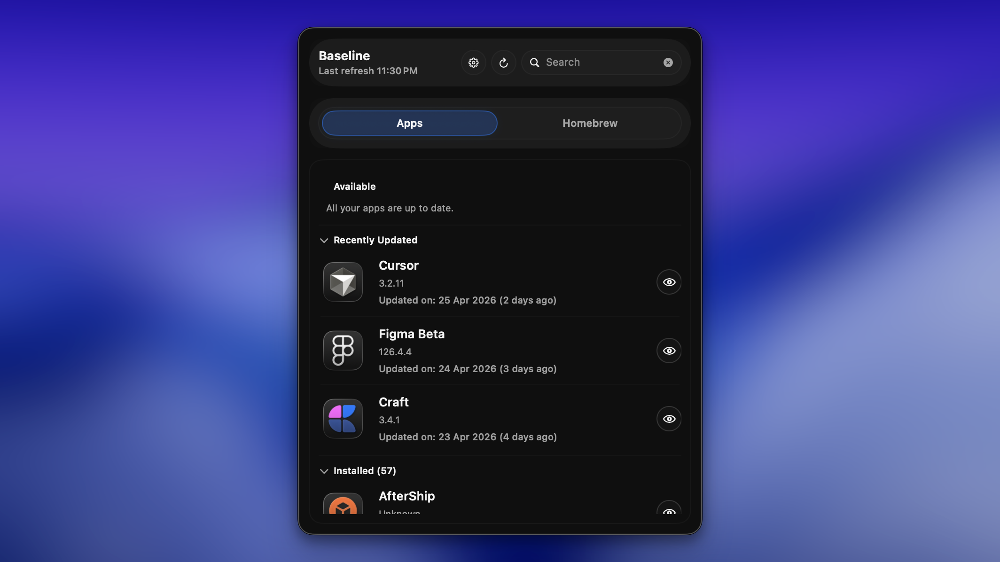
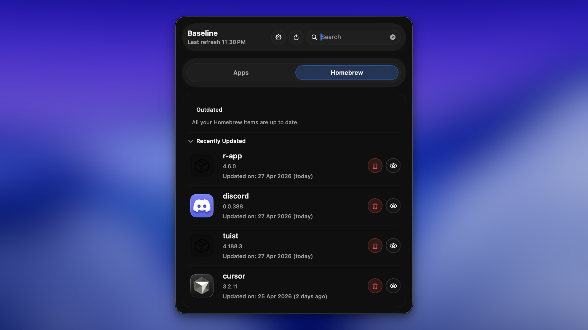
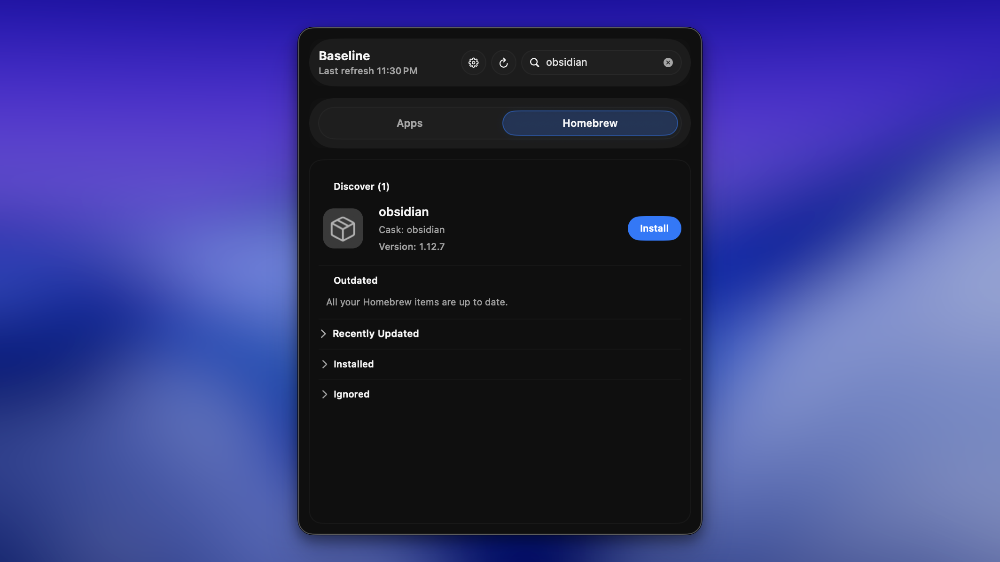

# Baseline

Baseline is a standalone macOS menubar app for finding app updates through public update sources.

It scans installed apps, checks App Store, Sparkle/DevMate appcast, and Homebrew metadata, then shows update actions from the menu bar.

## Project Status

Baseline is early-stage macOS software. The core update-checking flow is functional, but the UI and packaging/release process are still evolving.

Unsigned builds are not notarized by Apple. macOS Gatekeeper may warn when opening them. If you are not comfortable with unsigned preview software, build from source or wait for a signed release path.

## Features

- Menubar-first UX (`LSUIElement=true`)
- Installed app scanning from system, user, and custom app directories
- Update detection through:
  - App Store lookup API
  - Sparkle/DevMate appcasts
  - Homebrew cask metadata
- View installed and recently updated apps from the `Apps` tab

  

- View installed and recently updated Homebrew casks/formulae from the `Homebrew` tab

  

- Search Homebrew from the menu bar search field to discover installable casks/formulae

  

- Best-effort App Store updates through `mas upgrade <appId>` when `mas` is installed
- Homebrew-managed app inventory and update actions for installed casks and formulae when Homebrew is installed
- Search-driven Homebrew discovery from the menu bar search button:
  - Search installable casks and formulae
  - Install casks with `brew install --cask <token>` when `brew` is installed
  - Install formulae with `brew install <token>` when `brew` is installed
- External fallback links when local CLI tooling is unavailable

## Download

Downloadable preview builds, when available, are published on the GitHub Releases page as unsigned DMGs.

For each release:
- Download `Baseline-<version>-unsigned.dmg`.
- Verify the published SHA-256 checksum if one is provided.
- Drag `Baseline.app` to `/Applications`.

Because the app is unsigned, macOS may show an unidentified-developer warning. This is expected for preview builds without an Apple Developer account.

## Build From Source

Requirements:
- macOS 26 or newer
- Xcode with Swift 6 support
- Tuist

Install Tuist:

```bash
brew install tuist
```

Generate the Xcode project:

```bash
TUIST_SKIP_UPDATE_CHECK=1 tuist generate
```

Open `Baseline.xcworkspace` in Xcode and run the `Baseline` scheme.

Generated Xcode projects and workspaces are intentionally not committed. Tuist is the source of truth for project generation.

## Build And Test

```bash
TUIST_SKIP_UPDATE_CHECK=1 tuist generate --no-open
TUIST_SKIP_UPDATE_CHECK=1 tuist xcodebuild -project Baseline.xcodeproj -scheme Baseline -configuration Debug -destination 'platform=macOS' -derivedDataPath .DerivedData build
xcodebuild -project Baseline.xcodeproj -scheme Baseline -destination 'platform=macOS' -derivedDataPath .DerivedData test
```

## Package An Unsigned DMG

```bash
scripts/create-unsigned-dmg.sh 0.1.0
```

The script builds a Release app, creates `dist/Baseline-0.1.0-unsigned.dmg`, and prints a SHA-256 checksum. See [docs/RELEASING.md](docs/RELEASING.md) for release steps and limitations.

## Optional Local Tooling

- `mas` is optional. Without it, Baseline opens the App Store page externally instead of running `mas upgrade`.
- Homebrew (`brew`) is optional. Without it, Baseline opens external Homebrew/app pages instead of running install/upgrade actions.

## Architecture

Baseline keeps update logic outside SwiftUI views:

- `Sources/Models` defines domain contracts and persistence snapshots.
- `Sources/Clients` contains source-specific IO, parsing, and mapping.
- `Sources/Store` coordinates refresh lifecycle, policy, persistence, and actions.
- `Sources/Views` renders state and dispatches user intents.
- `Tests` covers parsers, version logic, store policy, security checks, and fixtures.

See [docs/ARCHITECTURE.md](docs/ARCHITECTURE.md) for more detail.

## Privacy And Security

Baseline uses public update pathways. It does not require private Apple frameworks, does not require a backend service, and does not require an API key.

The app may query public services such as Apple lookup endpoints, Sparkle/appcast URLs declared by installed apps, and Homebrew metadata endpoints. Homebrew and `mas` actions run locally when users choose those update paths.

Report suspected security issues using the process in [SECURITY.md](SECURITY.md).

## Contributing

Contributions are welcome. Start with [CONTRIBUTING.md](CONTRIBUTING.md), follow the pull request template, and run the validation commands before opening a PR.

## License

Baseline is licensed under the GNU General Public License v3.0. See [LICENSE](LICENSE).
